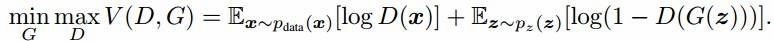

# The-introduction-of-ACGAN
> Author: Wang Bowen (王博文) 
> Inspired by [Conditional Image Synthesis with Auxiliary Classifier GANs](https://arxiv.org/abs/1610.09585) 
> All rights reserved

## Introduction
>The original GAN uses binary classification errors as a measure of how close the true distribution is to the generated distribution. When the discriminator is the optimal discriminator, the loss function of the generator is equivalent to the JS divergence between the true distribution and the generated distribution.

>CGAN introduces a conditional variable c in both the generation model G and the discriminant model D. As it trains, the discriminator inputs correctly matched labels and samples. When the discriminator training is completed, the discriminator's output will be true only if the discriminator inputs both real samples and labels matching the real samples at the same time. When the generator is trained, its input is random noise and artificially designed labels, and its output is the data corresponding to the labels. Train the generator to send the output data of the generator and the label of the input generator to the discriminator. This is because the discriminator's output will only be true if the discriminator inputs both real samples and labels that match the real samples. In order to make the discriminator output true at this time, the generator must learn to generate a real picture according to the label.
  
  
  
  
  
 # ACGAN 的介绍
 ## 简介
 >原始 GAN 使用二元分类误差作为真实分布与 生成分布相近度的度量。当判别器为最优判别器时，生成器的损失函数等价于真实分布 与生成分布之间的 JS 散度。
  
  
  
>CGAN在生成模型 G 和判别模型 D 的建模中均引入条件变量 c。在它训练时，判别器输入正确配对的标签和样本。当判别器训练完成时，判别器只有同时输入真实的样本和与真实样本匹配的标签时，判别器的输出才会为真。生成器训练时，它的输入是随机的噪声和人工设计的标签，它的输出是标签对应的数据。训练生成器要把生成器输出的数据和输入生成器的标签都送到判别器中。因为判别器只有同时输入真实的样本和与真实样本匹配的标签时，判别器的输出才会为真。这时为了使判别器输出为真，生成器必须学会按照标签去生成真实的图片。
 
   
